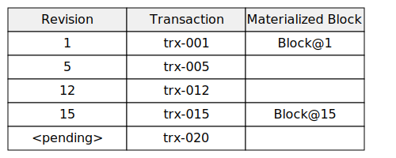
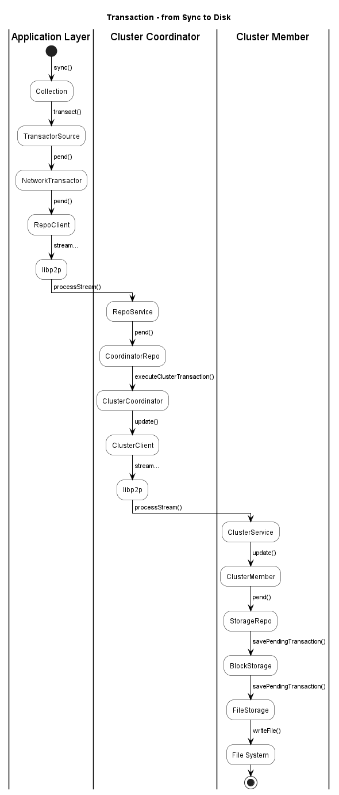
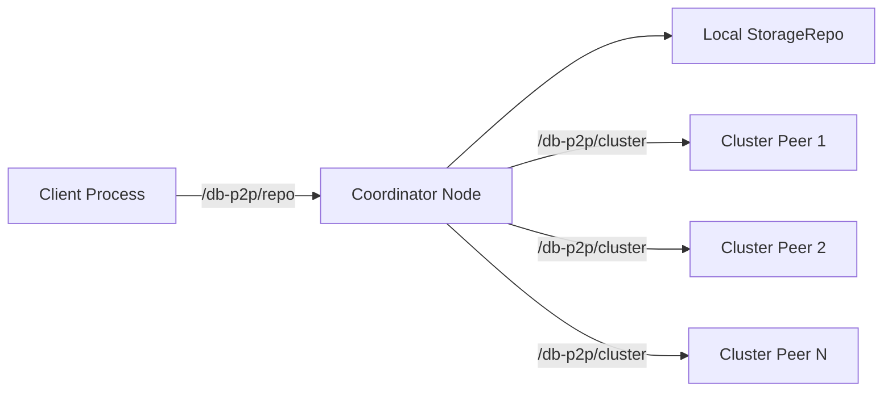

# Optimystic Technical Architecture

Optimystic is a distributed database for peer-to-peer networks. It provides ACID transactions over content-addressed, versioned block storage with strong consistency guarantees, Byzantine fault tolerance, and adaptive topology management — all without centralized coordination.

This document is the top-level architectural map. It explains the layers, names the parts, and points to the deep-dive docs for each subsystem.

## Design Principles

* **ACID over content-addressed, distributed storage.** Related blocks live on independent peers; transactions span blocks and collections.
* **Log-first ordering.** A transaction's position in the log is decided by a collection's *log-tail cluster*; propagation to other blocks follows.
* **Optimistic concurrency.** Reads are captured as revision dependencies; validators re-check them at commit. Conflicts trigger replay, not blocking locks.
* **Pluggable execution engines.** The transaction payload is engine-specific — SQL statements for Quereus, JSON actions for the built-in ActionsEngine — and every cluster member re-executes deterministically to validate.
* **Byzantine resilience.** Cluster consensus uses Ed25519 signatures; validity disagreements escalate through a widening audience until consensus emerges; misbehaving peers are demoted or ejected via a reputation subsystem.
* **Self-healing topology.** Peer discovery, block replication, and capacity rebalancing react to churn automatically through FRET and the Arachnode ring hierarchy.
* **Cross-platform.** Node.js, browsers, and React Native are first-class. The core is transport-agnostic; libp2p and storage backends plug in at the edges.

## Package Layering

The monorepo is layered from abstract to concrete, with optional front-ends on top:

```
┌──────────────────────────────────────────────────────────────────┐
│ Applications                                                     │
│   demo · reference-peer · user apps                              │
├──────────────────────────────────────────────────────────────────┤
│ SQL / Query Front-End (optional)                                 │
│   quereus-plugin-optimystic · quereus-plugin-crypto              │
├──────────────────────────────────────────────────────────────────┤
│ Core Abstractions                                                │
│   db-core — Blocks, Chains, BTrees, Logs, Collections,           │
│            Trackers, TransactionCoordinator, NetworkTransactor   │
├──────────────────────────────────────────────────────────────────┤
│ P2P Implementation                                               │
│   db-p2p — libp2p wiring, cluster 2PC, dispute protocol,         │
│           rebalance/spread-on-churn, Arachnode adapter           │
├──────────────────────────────────────────────────────────────────┤
│ Storage Adapters                                                 │
│   db-p2p-storage-fs (Node fs) · db-p2p-storage-rn (LevelDB)      │
│   db-p2p-storage-web (IndexedDB) · db-p2p-storage-ns (SQLite)    │
├──────────────────────────────────────────────────────────────────┤
│ Network Substrate                                                │
│   libp2p + FRET DHT                                              │
└──────────────────────────────────────────────────────────────────┘
```

| Package | Role |
|---------|------|
| [`@optimystic/db-core`](../packages/db-core/README.md) | Interfaces, data structures, transaction coordination — no network or disk assumptions |
| [`@optimystic/db-p2p`](../packages/db-p2p/readme.md) | Concrete libp2p node, cluster consensus, dispute protocol, Arachnode ring discovery |
| `@optimystic/db-p2p-storage-fs` | Filesystem persistence (Node.js) |
| `@optimystic/db-p2p-storage-ns` | NativeScript persistence via SQLite |
| `@optimystic/db-p2p-storage-rn` | React Native persistence via LevelDB (`rn-leveldb`) |
| `@optimystic/db-p2p-storage-web` | Browser persistence via IndexedDB |
| [`@optimystic/quereus-plugin-optimystic`](../packages/quereus-plugin-optimystic/README.md) | Virtual-table module binding SQL tables to Optimystic tree collections; `StampId()` UDF; `QuereusEngine` validator |
| `@optimystic/quereus-plugin-crypto` | SQL UDFs for `digest`, `sign`, `verify`, `hash_mod`, `random_bytes` |
| `@optimystic/reference-peer` | Interactive/batch/service CLI (`optimystic-peer`) for development, testing, and meshed experimentation |
| `@optimystic/demo` | Minimal Tree+Diary sample against `TestTransactor` |

`db-p2p` also exports an `@optimystic/db-p2p/rn` subpath that omits the Node-only TCP transport for Metro/Hermes compatibility.

## Core Concepts

| Term | Meaning |
|------|---------|
| **Block** | Immutable, versioned unit of storage; content-addressed by a base32 `BlockId`. |
| **Operation** | Splice-style mutation on one block: `[entity, index, deleteCount, inserted]`. |
| **Transform** | A set of inserts/updates/deletes applied to a single block. |
| **Action** | A logical mutation scoped to one *collection*, realized as one or more operations. |
| **Transaction** | A logical mutation spanning one or more collections, carrying statements, a read set, and a stamp. |
| **Collection** | A logical grouping of blocks with a header block, a transaction log, and a data structure (Tree, Diary, …). |
| **Cluster** | The *K* peers responsible for a block, chosen deterministically by FRET ring distance from the block ID. |
| **Coordinator** | The peer (or the local process) that orchestrates a transaction round with the cluster. |
| **Log tail / critical block** | The latest block in a collection's transaction log — the rendezvous for ordering and consensus. |
| **Stamp ID** | Hash of the transaction stamp (peer, timestamp, schema hash, engine, TTL); stable from BEGIN to COMMIT. Exposed to SQL via `StampId()`. |
| **Transaction ID** | Hash of stamp ID + statements + read dependencies; the final content-addressed identity, computed at COMMIT. |
| **Read dependency** | `(blockId, revision)` observed during execution; verified at commit for optimistic concurrency. |

## Storage Model

Block storage (see [repository.md](repository.md)) is versioned and reconstructive:

* Each block retains a revision chain: `(actionId, rev, transform, [materialized], conditions)`.
* On read, the storage materializes the requested revision by applying transforms from the nearest materialized ancestor.
* Pending transforms coexist with committed revisions and can be explicitly read, committed, or cancelled.
* Old revisions and materializations are swept opportunistically; anything still referenced can be restored from archival storage.



## Data Structures

Built on the block layer (see `db-core` [documentation index](../packages/db-core/README.md#documentation)):

* **Chains** — linked blocks used as stacks, queues, or logs (32 entries/block).
* **BTrees** — B+trees with path-based cursors, range queries, and automatic rebalancing.
* **Logs** — SHA-256-hashed transaction logs built on chains; every entry carries the transaction ID, revision, affected blocks, and action payload.
* **Collections** — high-level wrappers combining a data structure with a log:
  * **Tree** — indexed key/value, range scans, batched `replace()`
  * **Diary** — append-only event log
  * **Hashed Tree** *(planned)* — Merkle-style tree with per-node hashes

Each collection's header block is content-addressed from the collection name, so every peer in a network can discover it deterministically.

## Transaction Model

Optimystic transactions are **coordinator-centric**, **log-tail-ordered**, and **multi-collection-capable**. Detailed spec: [transactions.md](transactions.md).

### Identity & snapshot isolation

* A `TransactionStamp` is created at BEGIN with `{peerId, timestamp, schemaHash, engineId, expiration}`; its hash is the **stamp ID** — stable for the transaction's lifetime.
* Actions execute immediately against local trackers, giving snapshot isolation to the initiating process before any network round-trip.
* At COMMIT, the **transaction ID** is computed from stamp ID + statements + reads and becomes the log-addressable identity.

### Five-phase lifecycle

```
         GATHER           PEND              COMMIT            PROPAGATE         CHECKPOINT
        (only if      (all clusters     (critical log-       (managed by       (managed by
         multi-       receive ops +      tail clusters         clusters)         clusters)
         collection)   full Transaction  achieve consensus)
```

1. **GATHER** *(multi-collection only)* — each affected collection's log-tail cluster nominates consensus participants; the coordinator merges the lists into a temporary **supercluster** for the round.
2. **PEND** — every affected block cluster receives the operations hash and the full `Transaction`. Each cluster member independently re-executes through its engine, validates reads against current revisions, and signs a promise.
3. **COMMIT** — the coordinator drives consensus at each critical log-tail cluster; all must succeed or the transaction aborts.
4. **PROPAGATE** — clusters finalize local block revisions.
5. **CHECKPOINT** — each collection's log appends a checkpoint entry referencing the transaction CID.



### Pluggable engines

The `ITransactionEngine` interface turns statements into actions and validates re-execution. Two engines ship today:

* **ActionsEngine** — native JSON actions; used by the built-in collections and the test harness.
* **QuereusEngine** — SQL statements executed through [Quereus](https://github.com/nicktobey/quereus); validators re-parse and replay the SQL against the same schema.

Determinism is a hard requirement: non-deterministic SQL (`RANDOM`, `now()`) is rejected at schema time so that every validator produces the same block operations.

### Conflict resolution

If PEND detects stale reads or a conflicting concurrent transaction, the coordinator abandons pending work, pulls the winning actions, replays the client's own actions atop the new state, and retries. Collection handlers declare a `filterConflict` policy for merging concurrent updates where possible (see [`Collection`](../packages/db-core/docs/collections.md)).

## Network & Consensus Layer

`db-p2p` realizes the abstractions over libp2p and FRET (Flexible Routing Efficient Transport — a Kademlia-style DHT). Full detail in [db-p2p README](../packages/db-p2p/readme.md).

### Three-protocol split

| Protocol | Who uses it | Purpose |
|----------|-------------|---------|
| `/db-p2p/repo/1.0.0` | External client ↔ coordinator node | Client-facing `IRepo` operations (`get`, `pend`, `commit`, `cancel`). |
| `/db-p2p/cluster/1.0.0` | Coordinator ↔ cluster peers | Cluster-record exchange for 2-phase commit. |
| `/{prefix}/dispute/1.0.0` | Dissenting member ↔ enlistees | Validity dispute escalation (opt-in, see below). |



### Two-phase commit inside a cluster

A `ClusterMember` runs the protocol:

1. **Promise** — each member validates the operation, signs the promise hash with its Ed25519 private key, and returns it in the `ClusterRecord`.
2. **Commit** — once a qualifying set of promises has been collected, members sign the commit hash and apply the operation to their local `StorageRepo`.

Every incoming record is verified end-to-end: `validateSignatures()` checks every promise and commit signature against `record.peers[peerId].publicKey`, so a coordinator cannot forge votes. Reputation, equivocation, and dispute mechanisms extend this baseline.

### Proximity verification

`CoordinatorRepo` rejects writes for blocks the local node is not responsible for (`pend`, `cancel`, `commit` throw `Not responsible for block(s)`). Reads log a warning but still serve best-effort. A 60-second, 1000-entry LRU caches cluster membership lookups to keep the check cheap. See [internals.md](internals.md#proximity-verification).

### Read dependency validation

Every read through `TransactorSource.tryGet()` records a `ReadDependency`. At commit, validators ensure no observed block has advanced — preventing write-skew anomalies in optimistic concurrency. `CacheSource` deduplicates reads; non-existent blocks record `revision: 0`.

## Byzantine Fault Tolerance

Two complementary mechanisms keep the network honest.

### Right-is-Right — cascading validity disputes

When cluster peers disagree on transaction *validity* (not merely staleness), the transaction is blocked and disagreeing members deterministically elect a **dissent coordinator** (nearest dissenter to the block ID in FRET distance). The dissent coordinator enlists the next ring of peers to re-execute and vote. If the expanded audience also splits, escalation continues; the audience grows geometrically until consensus emerges, and the losing side is ejected. Honest disagreements resolve in one round; coordinated attacks pay a rising cost curve. Full design, scenarios, and current-vs-target state: [right-is-right.md](right-is-right.md).

### Reputation & equivocation

Each node tracks peer behavior through a `PeerReputation` service:

| Reason | Weight |
|--------|--------|
| `Equivocation` (flipped vote for same phase) | 100 — immediate ban |
| `FalseApproval` (approved a tx the wider audience rejected) | 40 |
| `DisputeLost` (rejection overturned) | 30 |

Scores ≥ 20 trigger deprioritization; ≥ 80 trigger banning; penalties decay exponentially. An **EngineHealthMonitor** tracks a node's own dispute losses and, above threshold, suppresses outbound disputes to stop self-harming.

## Topology & Storage Management

### Arachnode — concentric storage rings

Long-term storage is organized into nested DHTs where each outer ring partitions the keyspace on one more bit:

* **Ring Zulu** — the transaction ring; handles all transaction traffic and short-term caching.
* **Ring 0** — innermost; a node here stores the entire keyspace (only feasible on small networks).
* **Ring N** — each outer ring halves the per-node range. Nodes shift outward as they fill, inward when underutilized.

Each node records its target ring via `ringDepth = ceil(-log2(capacity / demand))`. The capacity/demand signals are gossiped via FRET, so ring membership is discovered alongside normal peer exchange. See [arachnode.md](arachnode.md).

### Block restoration

When a node is missing a block or revision, the `RestorationCoordinator`:

1. Hashes the block ID to a keyspace coordinate.
2. Uses FRET's `assembleCohort()` to order candidate peers (connected first, then by distance).
3. Queries Ring Zulu; if no hits, walks inward to finer storage rings.
4. Filters candidates by their advertised partition so restoration targets only responsible peers.

`db-p2p` wraps FRET in an `ArachnodeFretAdapter` that layers ring-aware semantics on top of the pure DHT. Enable via `arachnode: { enableRingZulu: true }` (the default).

### Churn response: Rebalance & Spread-on-Churn

Two `Startable` monitors react to `connection:open` / `connection:close` events (see [internals.md](internals.md#cluster-health-monitors)):

* **RebalanceMonitor** — after topology shifts, scans tracked blocks and emits `gained` / `lost` / `newOwners`, throttled to one scan per minute.
* **SpreadOnChurnMonitor** — when peers leave, middle-ranked peers proactively push replicas outward using `BlockTransferClient.pushBlocks()`. Fan-out is bounded to `2·d` where `d` grows under rapid churn or low cluster health, capped at `clusterSize / 2`.

Both monitors are suppressed during detected network partitions (`PartitionDetector`).

## Cohort Topics, Reactivity, and Matchmaking

A shared **cohort-topic** substrate ([cohort-topic.md](cohort-topic.md)) provides FRET-backed topic trees for any subsystem that needs to find, attach to, or fan out from a named set of peers. Topic trees grow from a single root cohort outward in tiers, sharded by peer-ID prefix; participants walk toward the root from an estimated max tier and only follow explicit promotion redirects outward, giving anti-flood behavior by construction. The layer supplies addressing, willingness-gated admission, TTL-refreshed soft state, cohort threshold signatures, and a tier ladder (T0 essential → T3 luxury) that lets nodes prioritize transaction work over discretionary forwarding.

Two applications run on the substrate today:

* **Reactivity** ([reactivity.md](reactivity.md)) — push-tree mode. Notifications about collection commits fan out through a tree rooted at the tail block's coordinate (rotating, to deny attackers a persistent target). Threshold signatures reuse the commit certificate; subscribers backfill from a replay buffer at the nearest forwarder. T3 (luxury) — never starves transaction processing.
* **Matchmaking** ([matchmaking.md](matchmaking.md)) — directory mode. Providers and seekers register at a stable per-task topic; cohorts return advisory provider sets to seekers. Used for cluster formation, task distribution, capability lookup, and voting-quorum assembly. T2 (functional).

## SQL Integration

`@optimystic/quereus-plugin-optimystic` registers an `optimystic` virtual-table module with [Quereus](https://github.com/nicktobey/quereus). Tables declared `USING optimystic('tree://app/name', transactor='network', keyNetwork='libp2p')` are backed by a distributed Tree collection — the plugin serializes the primary key as the tree key, JSON-encodes the row, and maps Quereus `BEGIN` / `COMMIT` / `ROLLBACK` to Optimystic transaction sessions.

* A `StampId()` UDF exposes the current transaction's stamp ID for application use.
* `QuereusEngine` implements `ITransactionEngine`: it re-executes SQL statements through Quereus for validation and computes schema hashes from the catalog.
* Custom `keyNetwork` and `transactor` implementations are registered via `registerKeyNetwork` / `registerTransactor`.

Quereus is **not** SQLite — columns default to NOT NULL, all tables are virtual, temporal/JSON are native types, and there are no triggers. See the [plugin README](../packages/quereus-plugin-optimystic/README.md#quereus-sql-dialect) and Quereus's [SQL Reference §11](https://github.com/nicktobey/quereus/blob/main/docs/sql.md).

## Application Integration

Typical patterns:

| Use case | Tools |
|----------|-------|
| Append-only event log | `Diary` collection |
| Indexed key/value or documents | `Tree` collection |
| Custom merge semantics | `Collection` with a `filterConflict` policy |
| SQL front-end | Quereus + `quereus-plugin-optimystic` |
| Multi-collection atomic mutation | `TransactionCoordinator` / `TransactionSession` |

Nodes can be run as transaction nodes (Ring Zulu only), storage nodes (inner rings), public gateways, or bootstrap nodes. A node with no peers and no listen addresses is a valid solo / mobile configuration.

## Downstream Projects

[**Sereus**](https://github.com/gotchoices/sereus) is a consent-based Web3 fabric that uses Optimystic as its storage engine and Quereus as its SQL processor, layering invitation-only or public trust domains ("strands") and per-user device groups ("cadres") over the Optimystic stack.

## Observability

Instrumentation is built on the `debug` library (see [debugging.md](debugging.md)):

* Base namespaces: `optimystic:db-core:*` and `optimystic:db-p2p:*`.
* Sub-namespaces isolate each subsystem: `network-transactor`, `batch-coordinator`, `cluster`, `cluster-member`, `storage-repo`, `block-storage`, `storage:restoration`, `coordinator-repo`, etc.
* Correlation IDs: `trxId` at the coordinator, `actionId` inside the network transactor, `messageHash` in cluster consensus.
* `OPTIMYSTIC_VERBOSE=1` enables batch, peer, and FRET-candidate tracing.

## Document Map

| Document | Focus |
|----------|-------|
| [optimystic.md](optimystic.md) | Application developer's guide — setup, collections, transactions, SQL, deployment |
| [transactions.md](transactions.md) | Transaction protocol: lifecycle, client sync, multi-collection coordination, pluggable engines |
| [repository.md](repository.md) | Block repository operations and lifecycle |
| [right-is-right.md](right-is-right.md) | Validity dispute escalation and reputation |
| [arachnode.md](arachnode.md) | Concentric ring storage architecture |
| [cohort-topic.md](cohort-topic.md) | Shared topic-tree substrate for reactivity, matchmaking, and future directory services |
| [reactivity.md](reactivity.md) | Push-based change notifications (cohort-topic push-tree application) |
| [matchmaking.md](matchmaking.md) | Peer discovery and quorum assembly (cohort-topic directory application) |
| [correctness.md](correctness.md) | Formal safety and liveness properties |
| [internals.md](internals.md) | Developer guide: data flow, invariants, pitfalls |
| [debugging.md](debugging.md) | DEBUG namespaces and logging conventions |
| [releasing.md](releasing.md) | Release process |
| [db-core README](../packages/db-core/README.md) | Core package API |
| [db-p2p README](../packages/db-p2p/readme.md) | P2P package architecture |
| [quereus-plugin-optimystic README](../packages/quereus-plugin-optimystic/README.md) | SQL integration |

## Glossary

* **Action** — logical mutation to one collection; compiles to one or more operations. Carries a stamp ID.
* **Arachnode** — the concentric-ring storage architecture layered over FRET.
* **Authority** — an entity controlling specific collections or operations at the application layer.
* **Block** — immutable, versioned storage unit; content-addressed by `BlockId`.
* **Cluster** — the peers responsible for a block, selected by FRET ring distance.
* **Coordinator** — the peer orchestrating a transaction round with a cluster.
* **Collection** — a named group of blocks with a header, data structure, and transaction log.
* **Critical block** — the log-tail block whose cluster gates a collection's transaction ordering.
* **DHT / FRET** — Flexible Routing Efficient Transport — the Kademlia-style DHT overlay on libp2p providing peer discovery, cohort assembly, and ring metadata.
* **Dissent coordinator** — the dissenting member (deterministically selected by FRET distance) that leads a dispute escalation.
* **Engine** — component that turns statements into actions and re-executes them for validation (`ActionsEngine`, `QuereusEngine`).
* **Matchmaking** — rendezvous-based pairing of peers at DHT keys derived from local bits + task hash.
* **Operation** — splice on one block; `[entity, index, deleteCount, inserted]`.
* **Pool** — a forming block not yet finalized or committed.
* **Read dependency** — `(blockId, revision)` observed during execution, verified at commit.
* **Rendezvous point** — DHT location where peers meet to coordinate; derived from a rendezvous key.
* **Ring Zulu** — the outermost ring; the transaction ring. Inner rings (0, 1, …) partition the keyspace more finely.
* **Stamp ID** — hash of a `TransactionStamp`; stable from BEGIN to COMMIT. Exposed by `StampId()` in SQL.
* **Supercluster** — temporary peer set aggregated from multiple critical clusters during a multi-collection transaction.
* **Transaction** — logical mutation spanning one or more collections; identified by the hash of stamp ID + statements + reads.
* **Transaction ID** — final content-addressed transaction identity, computed at COMMIT.
* **Transform** — set of inserts/updates/deletes for one block.

## Status & Evolution

Parts of the system — notably cascading dispute escalation with synchronous blocking, client-signed transactions, and full cross-collection transactions — are partially implemented. The target designs are captured in the referenced docs; the implementation tracks toward them. Current behaviour is always the authoritative reference; check the cited source files before assuming a target mechanism is in place.

**Provenance.** The logical-log-plus-blocks transaction model derives from the design of [AliveBase](https://github.com/Digithought)'s transaction system. Optimystic's peer-to-peer substrate, cluster consensus, dispute escalation, and Arachnode ring hierarchy extend that foundation into a decentralized setting.
