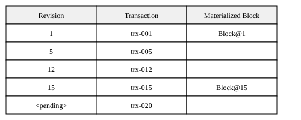

# Block Repository

## Overview

This document outlines the design for a Block Repository that provides efficient access to versioned data. The system manages blocks of data with versioning capabilities, allowing users to retrieve blocks at specific versions, update blocks conditionally, and mark blocks for eventual deletion.

The system provides these core operations through the `IRepo` interface
(`packages/db-core/src/network/i-repo.ts`):
- `get(blockGets[])`: Fetch blocks by their IDs and versions or specific transactions
- `pend(request)`: Post a transaction for a set of blocks
- `cancel(actionRef)`: Cancel a pending transaction
- `commit(request)`: Commit a pending transaction

`getStatus(actionRefs[])` — get statuses of block actions — is *not* on `IRepo`; it lives one layer
up on `ITransactor` (`packages/db-core/src/transactor/transactor.ts`), which is what applications
call. The sections below describe the per-block repo operations.

## Clusters

The Block Repository is designed around peer proximity in the DHT network.  Each peer is responsible for at least transactional (short term) storage of blocks in the address proximity, thus a given Block's storage is distributed across multiple peers (the "cluster").  When performing operations on a cluster, a client will choose a "coordinator" peer, which may be arbitrarily chosen, or chosen based on past performance or ID proximity.  The coordinator is responsible for coordinating the operation across the cluster, for the given transaction.

Here is how a transaction proceeds for a given cluster:
1. The coordinator receives the mutation (e.g. pend, commit, cancel), validates it, puts it in a record with a TTL, signs its own promise on it, then sends it in parallel to all other peers in the cluster.
2. If the coordinator receives a promise from the necessary number of peers, it, in parallel, responds with success to the client, and propagates the record with its own signed completion to the other peers in the cluster. 

* If the coordinator does not receive a promise from the necessary number of peers, before the TTL expires, or it receives failures, is signs as a failure and returns failures to the client.
* If the client looses connection to the coordinator, it can retry with a new coordinator.
* Peers will not sign their promise on a transaction that contradicts a previous transaction until the prior transaction is known to have failed or succeeded.  If a new coordinator is chosen, it will have to confirm consensus on the prior attempt before proceeding.
* If Peers receive invalid requests from other peers, they will whisper with the other peers to exclude the invalid peer from the cluster in the future.

## Repository Operations Description

### 1. `get(blockGets[])`

- **Purpose**: Fetch blocks by their IDs and versions or a specific transaction
- **Input**: Array of `BlockGet` objects containing:
  - `blockId` - A unique identifier for the block
  - `context` - Optional transaction context specifying either a revision or pending transaction
- **Output**: Array of `GetBlockResult` objects containing:
  - `block` - The block data
  - `state` - Current block state including latest revision or deletion status. `state.latest` is
    the newest revision the *answering repo* holds for the block — not necessarily the revision of
    the `block` it just returned
  - `materialized` - Optional; the `(rev, actionId)` the returned `block` actually is. Equals
    `state.latest` for an unpinned read; an older revision when a revision-pinned read serves older
    content. Consumers that need "what revision did this read observe?" (read-dependency recording)
    or must label the content when passing it on (a block-repair archive) use this, falling back to
    `state.latest` only for producers that omit it. One field carrying both halves, so a label can
    never pair one revision's number with another's action id
- **Behavior**: 
  - If no context is provided, returns the latest version
  - If a revision is specified, returns the block at the highest committed revision at or below it
  - If a transaction ID is specified, returns the block with pending changes applied
  - Fails if requesting a deleted block with pending transaction

### 2. `pend(request)`

- **Purpose**: Post a transaction for a set of blocks
- **Input**: `PendRequest` containing:
  - `transform` - The changes to apply
  - `actionId` - Action identifier
  - `pending` - How to handle existing pending transactions
- **Output**: `PendResult` indicating success or failure with pending transaction information
- **Behavior**:
  - Creates metadata for new blocks if needed
  - Can fail if pending='fail' and other transactions are pending
  - Saves block-specific transforms for each affected block

### 3. `cancel(actionRef)`

- **Purpose**: Cancel a pending transaction
- **Input**: `ActionBlocks` containing block IDs and transaction ID
- **Behavior**: Removes the pending transaction from all specified blocks

### 4. `commit(request)`

- **Purpose**: Commit a pending transaction
- **Input**: a single `RepoCommitRequest` object containing:
  - `blockIds` - Blocks covered by this commit
  - `actionId` - Action identifier
  - `rev` - Revision being committed
  - `tailId` - Optional; the committing collection's chain tail block id, threaded through so the
    committing node can anchor the emitted change event
  - `blockDigests` - Optional; per-block declarations of what each block will contain once this
    action commits (see *Declared block content* below)
- **Output**: `CommitResult` indicating success or missing transactions needed
- **Behavior**:
  - Verifies expected revision matches current state
  - Updates block metadata and revision
  - Promotes pending transaction to committed state
  - Handles block deletion if specified in transform

#### Declared block content (`blockDigests`)

The client that authored a transaction knows what every block it touches will contain once the
transaction lands, so it says so: `blockDigests` maps a block id to a hash of that block's
post-commit content, plus the committed revision of the base the hash was computed from (absent for
an inserted block, whose content does not depend on any base). Only the client can declare this — a
coordinator forwards a commit without materializing it, and may not even have seen the pend.

Three properties are load-bearing:

- **It is optional, per block.** The client computes digests from what it already has in memory and
  never pays a network read to describe itself, so a block whose base is not locally cached is
  simply left out. An undeclared block is not an error; it falls back to the corroboration the
  cohort already does. The field is omitted entirely — not sent as an empty object — when a request
  declares nothing.
- **It rides *inside* the commit request.** The request is the consensus message, and the cluster
  hash helpers canonicalise that message generically, so the declarations land inside every cohort
  signature's preimage with no change to the hashing. A peer built before this field existed still
  hashes the bytes it received, so upgraded and un-upgraded peers agree on the same hash.
- **Each cohort sees only its own blocks.** One transaction's blocks are split across coordinators,
  and each per-coordinator batch becomes its own cluster record. The transactor therefore narrows
  the map to the batch's own block ids at the moment it sends — not once up front, because a failed
  batch is re-split across different coordinators on retry. Shipping the whole map would make one
  cohort sign for blocks it is not responsible for.

Declaring content must never break committing it. Computing a digest replays the staged changes
against the locally cached base, which can legitimately fail (another action's commit may have
folded a different shape into the cache); that block is then left undeclared rather than raising an
error out of the client's sync.

**Who checks it.** A declaration is worth nothing until someone independently reproduces it. Each
cohort member does that on the commit's *promise* round: it re-materializes the block from the
transform it was handed at pend and votes reject (reason `content-digest-mismatch`) when the result
disagrees. A member that cannot reproduce the answer — it never saw the pend, or it holds a
different base for an update-only block — abstains rather than guessing. See
[internals.md](internals.md) "Commit content-digest check (promise round)" for the full
checkable/abstain rule, and `docs/correctness.md` §2 **Content digest declaration** for what an
approval does and does not attest.

#### Invariant P — a pending record and a committed record never coexist for one action

A block never holds a pending record and a committed record for the same action id at the same
time. On the commit path this holds because promotion *moves* the record from the pending namespace
to the committed one atomically (a single rename on the filesystem backend, a synchronous two-map
swap in memory) rather than copying it.

Every **other** writer of a committed transform for a block must maintain the same invariant by
deleting that action's pending record when it writes the committed one. Today those writers are the
forward-write paths `BlockStorage.saveReplica` (replica persist, e.g. churn re-replication and the
divergence reconcile) and `BlockStorage.saveDeletion` (forward tombstone); both go through
`saveForwardRevision`, which performs the deletion. Any forward path added later inherits the
obligation.

`StorageRepo.pend` carries the mirror-image obligation: it must not *create* the coexistence in the
first place. A re-pend of a block this same action already committed at the requested revision (the
retry of a *torn action* — a write whose blocks committed one group at a time, some landing and the
rest refused) is waved through as **satisfied** and no pending record is written for it. Writing one
would strand it exactly as the paragraph below describes: `commit` partitions that block as
already-done and never promotes the record.

The invariant matters because a pending record left beside a committed one can never be promoted:
once the block's `latest` has advanced past the revision the record was pended at, a commit retry
partitions the block as already-done or stale and never revisits it. `pend` then reports that
record as a conflicting action on every later write to the block — under the fail-on-pending policy
the node refuses those writes outright and can only catch up by replication, so it looks healthy
and serves reads while silently contributing nothing to that block's writes.

The commit path itself also drops records that become unpromotable when it abandons a batch. It
does so **only** for divergence failures (this node holds no materializable base for a block, or
never received the pend), because the cluster layer reconciles the whole batch after those and every
block advances past the action. A genuine storage fault keeps the batch's pendings, because that
failure is retried and the retry can still replay them.

## Block Storage Repository

Block Storage Repository nodes maintain the following state information:
- Latest revision number
- Deletion status (if applicable)
- Pending transactions
- Materialized versions at specific revisions

The system uses a materialization strategy where:
- Blocks can be materialized at any revision by applying transforms sequentially
- Materialized versions are cached to improve performance
- Pending transactions can be applied on top of any materialized version

## Transaction Processing

Transactions go through the following lifecycle:
1. **Pending**: Posted via `pend()` but not yet committed
2. **Committed**: Applied to blocks and assigned a revision number
3. **Materialized**: Full block state computed and cached at specific revisions

The system supports:
- Optimistic concurrency through revision checking
- Transaction conflict detection
- Block restoration through callback mechanism
- Materialization caching for performance

## Block Lifecycle

* **Creation**: Blocks are created through insert transforms
* **Updates**: Applied through pending and committed transactions
* **Deletion**: Marked via delete transform, maintaining revision history

Revisions within a block also have a lifecycle:
* **Checkpoint materialization**: Each committed revision keeps its forward *transform* (the delta that
  produced it) forever, but a full *materialized* copy of the block is retained only at **checkpoint**
  revisions — every `CHECKPOINT_INTERVAL`th rev (default 32), plus the block's tip and the floor of each
  contiguous locally-held range. Redundant intermediate materializations are pruned incrementally as new
  commits land (under the block's write latch, no separate background pass): each commit deletes the
  now-superseded prior materialization unless that rev must be retained. Because every transform is kept
  and a materialization survives at each range floor + checkpoints, **every locally-held revision is still
  reconstructible** by replaying the forward transforms from the nearest retained materialization at or
  below it (replay depth bounded by `CHECKPOINT_INTERVAL`). This keeps storage growth O(revisions × delta
  size) instead of O(revisions × block size). Since no transform is dropped, `meta.ranges` is **unchanged**
  by sweeping — a swept rev is still honestly claimed as present. Pruning the *transforms* of cold ranges
  (which would fragment `ranges` and require restoration) is future work — see the cold-range transform
  offload backlog item.
* **Restoration**: Previous versions can be restored from archival storage as needed

## Implementation Notes

The system is implemented with these key components:
- `StorageRepo`: Main implementation of the repository operations
- `IBlockStorage`: Interface for block storage operations
- `RestoreCallback`: Optional mechanism for block restoration
- `withReadCache`: the single seam that puts the write-through read cache in front of a
  persistent raw storage. `StorageRepo` builds a fresh `BlockStorage` per block per call and
  `BlockStorage` re-reads block metadata on essentially every operation, so nothing above the
  raw-storage boundary memoizes — over a filesystem backend that is hundreds of reads of the same
  small files per statement. Why the cache is safe to read from (and the single-process-owner
  precondition it depends on) is argued in
  [`packages/db-p2p/docs/storage.md`](../packages/db-p2p/docs/storage.md) — see **Invariants** 1-5
  and **Core Components § 6, Write-through raw-storage cache**.

The storage layer maintains separate stores for:
- Block metadata (e.g. latest revision, deletion status)
- Revisions
- Transactions (both pending and committed)
- Materialized block versions

### Capacity estimation and staleness

`StorageMonitor.getCapacity` reports how full the store is. Used bytes come from the backend's
`getApproximateBytesUsed`, which is a **full-store scan** (LevelDB iterates every key+value, the
filesystem adapter stats the whole tree). Ring selection calls `getCapacity` several times per
operation, so the scan is memoized behind a short TTL (`usedBytesCacheTtlMs`, default 60s; `0`
disables it). Within the window callers share the cached value; concurrent misses share a single
in-flight scan; a supplied `usedBytes`/`availableBytes` override bypasses the scan (and the cache)
entirely.

Consequence: the reported `used`/`available`/`usedPercent` may lag reality by up to the TTL. This
staleness is acceptable — the sole consumer, ring selection (`RingSelector`), damps its move
triggers with EWMA smoothing, a hysteresis dead-band, and a 10-minute minimum dwell. A ≤60s-stale
reading cannot cause a wrong or premature ring move; at worst it delays one by up to the TTL, which
is immaterial against the 10-minute dwell. **`RingSelector` therefore needs no forced-fresh read at
decision boundaries** — the cached estimate is authoritative for its purposes.

- NOTE (tripwire): the default TTL (60s) equals the ring monitor tick interval (the `setInterval` in
  `libp2p-node-base.ts`, also 60s), so each `shouldTransition` tick folds a roughly-fresh sample into
  its EWMA. If `usedBytesCacheTtlMs` is ever raised *above* the tick interval, consecutive ticks would
  fold the *same* cached (stale) sample into the EWMA, biasing the smoothed depth toward the stale
  value. Damping (dead-band + 10-min dwell) absorbs this today; only revisit if the TTL is raised past
  the tick interval or the tick is shortened below the TTL.
