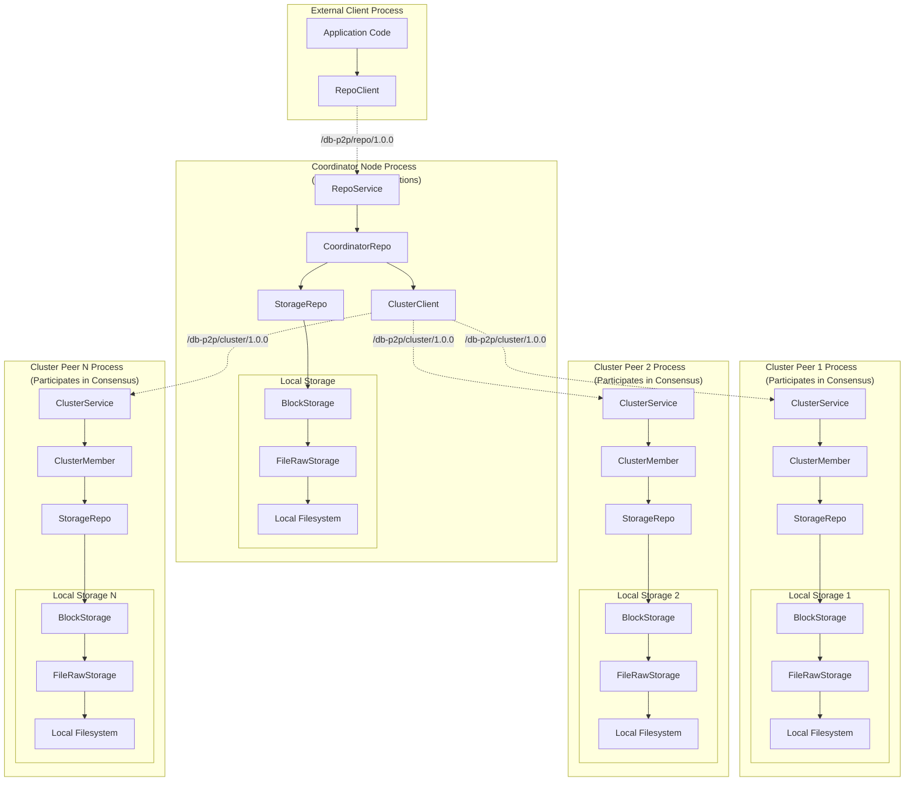
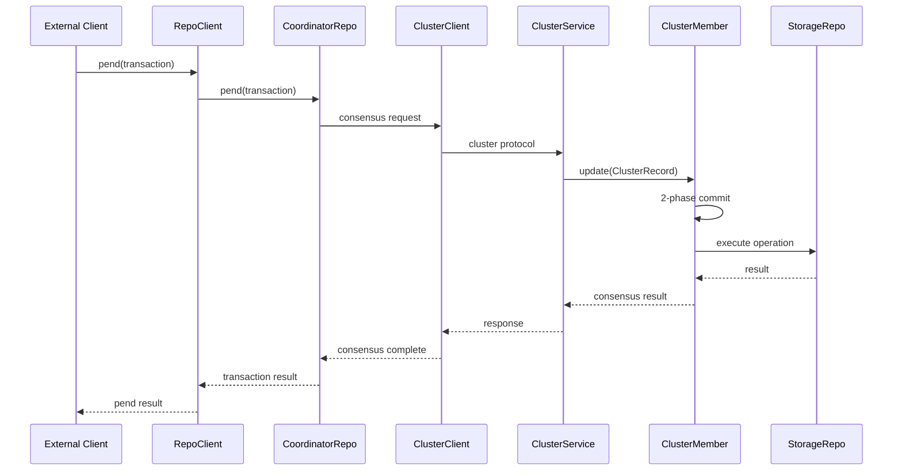

# Optimystic DB-P2P

A distributed peer-to-peer database system that provides concrete implementations of the Optimystic database abstractions using filesystem storage and libp2p networking. This package transforms the interfaces and abstractions from `@optimystic/db-core` into a fully operational distributed database system.

## Overview

The `@optimystic/db-core` package provides abstractions and interfaces for database operations—immutable blocks, versioned transactions, repository interfaces, and collection data structures. However, it doesn't provide concrete implementations for storage or distribution. `db-p2p` provides concrete implementations of the core abstractions using:

- **Filesystem storage** with serialization for persistent, versioned block storage
- **libp2p networking** for decentralized peer-to-peer communication
- **Distributed consensus** using 2-phase commit protocols for consistency
- **Fault-tolerant coordination** with automatic recovery and data restoration

The result is a fully operational distributed database system that implements the interfaces defined in the core abstractions to provide a complete distributed database system.

## Architecture Overview

The system provides three distinct communication interfaces, each serving different roles in the distributed architecture:



### Repo Layer: External Client Interface

The repo layer provides the interface for external clients to communicate with the distributed database:

- **RepoClient**: Allows external clients to connect to any coordinator node
- **RepoService**: Handles incoming requests from external clients
- **CoordinatorRepo**: Orchestrates distributed transactions by coordinating with cluster peers
- **Network transparency**: Same `IRepo` interface whether local or distributed

### Cluster Layer: Peer-to-Peer Coordination Interface

The cluster layer provides the interface for coordinators to communicate with other peers in the cluster:

- **ClusterClient**: Allows coordinators to send consensus requests to cluster peers
- **ClusterService**: Handles incoming consensus requests from coordinators
- **ClusterMember**: Implements 2-phase commit protocol for distributed consensus
- **Byzantine fault tolerance**: Ensures consistency even with peer failures

### Storage Layer: Persistent Data Implementation

The storage layer provides concrete implementations of the core database abstractions:

- **StorageRepo**: Implements `IRepo` interface with filesystem-based persistence
- **BlockStorage**: Provides versioned block storage with conflict resolution
- **FileRawStorage**: JSON-based file storage with atomic operations
- **Data restoration**: Pluggable restoration for missing data from network peers

## Detailed Component Architecture

### Repo Layer Components

#### `RepoClient`
Allows external clients to connect to coordinator nodes:

```typescript
class RepoClient extends ProtocolClient implements IRepo {
  static create(peerId: PeerId, peerNetwork: IPeerNetwork): RepoClient
  // Implements same IRepo interface as local storage
}
```

**Key Features:**
- Network-transparent database operations for external clients
- Automatic protocol handling and message serialization
- Error handling for network failures and timeouts
- Connection pooling and optimization

#### `RepoService`
Handles incoming repository protocol messages from external clients:

```typescript
class RepoService implements Startable {
  // Protocol: /db-p2p/repo/1.0.0
  // Transport: Length-prefixed JSON over libp2p streams
  async start(): Promise<void>
  async stop(): Promise<void>
}
```

**Key Features:**
- Registers and handles the repository protocol
- Routes operations from external clients to coordinator implementation
- Manages concurrent connections and stream processing
- Provides comprehensive error handling and logging

#### `CoordinatorRepo`
Orchestrates distributed transactions by coordinating with cluster peers:

```typescript
class CoordinatorRepo implements IRepo {
  constructor(
    keyNetwork: IKeyNetwork,
    createClusterClient: (peerId: PeerId) => ClusterClient,
    storageRepo: IRepo
  )
}
```

**Key Features:**
- Manages distributed transactions using cluster consensus
- Integrates with key network for peer discovery
- Uses cluster layer to coordinate with other peers
- Maintains local storage directly while coordinating remote operations

### Cluster Layer Components

#### `ClusterClient`
Allows coordinators to send consensus requests to cluster peers:

```typescript
class ClusterClient extends ProtocolClient implements ICluster {
  async update(record: ClusterRecord): Promise<ClusterRecord>
}
```

**Key Features:**
- Network communication for consensus operations
- Handles cluster record updates and responses
- Manages timeouts and retries for consensus requests

#### `ClusterService`
Handles incoming consensus requests from coordinators:

```typescript
class ClusterService implements Startable {
  // Protocol: /db-p2p/cluster/1.0.0
  // Handles ClusterRecord updates for consensus
}
```

**Key Features:**
- Registers and handles the cluster consensus protocol
- Routes consensus requests to local cluster member
- Manages concurrent consensus operations

#### `ClusterMember`
Implements 2-phase commit protocol for distributed consensus:

```typescript
class ClusterMember implements ICluster {
  async update(record: ClusterRecord): Promise<ClusterRecord>
  // Handles: Promise collection → Majority consensus → Commit execution
}
```

**Key Features:**
- Complete 2-phase commit protocol implementation
- Conflict detection and resolution
- Cryptographic signature verification
- Automatic timeout and cleanup management
- Uses storage layer to execute operations when consensus is reached

### Storage Layer Components

#### `StorageRepo`
Implements `IRepo` interface with filesystem-based persistence:

```typescript
class StorageRepo implements IRepo {
  async get(blockGets: BlockGets): Promise<GetBlockResults>
  async pend(request: PendRequest): Promise<PendResult>  
  async commit(request: CommitRequest): Promise<CommitResult>
  async cancel(trxRef: TrxBlocks): Promise<void>
}
```

**Key Features:**
- Concrete implementation of core database abstractions
- Orchestrates transactions across multiple blocks
- Handles revision conflicts and missing transaction detection
- Provides atomic commit operations with proper locking

#### `BlockStorage`
Provides versioned block storage with conflict resolution:

```typescript
class BlockStorage implements IBlockStorage {
  async getBlock(rev?: number): Promise<{ block: IBlock, trxRev: TrxRev }>
  async savePendingTransaction(trxId: TrxId, transform: Transform): Promise<void>
  async promotePendingTransaction(trxId: TrxId): Promise<void>
  async ensureRevision(rev: number): Promise<void>
}
```

**Key Features:**
- Maintains complete revision history for each block
- Reconstructs blocks by applying transforms to base versions
- Integrates with restoration callbacks for missing data
- Uses latches for thread-safe concurrent access

#### `FileRawStorage`
JSON-based file storage with atomic operations:

```typescript
// File system organization
{basePath}/
├── {blockId}/
│   ├── meta.json           # Block metadata and revision ranges
│   ├── revs/{rev}.json     # Revision → TrxId mappings
│   ├── pend/{trxId}.json   # Pending transactions
│   ├── trx/{trxId}.json    # Committed transactions
│   └── blocks/{trxId}.json # Materialized blocks
```

**Key Features:**
- Concrete filesystem implementation of storage interfaces
- JSON serialization for cross-platform compatibility
- Atomic file operations for consistency
- Organized directory structure for efficient access

## Integration Patterns

### Relationship to `@optimystic/db-core`

The `db-p2p` package provides concrete implementations of the core database abstractions:

```typescript
// Core provides interfaces and abstractions
import { IRepo, IBlock, Transform, IBlockStorage } from '@optimystic/db-core';

// P2P provides concrete implementations
class StorageRepo implements IRepo { /* filesystem-based repo */ }
class BlockStorage implements IBlockStorage { /* versioned block storage */ }
class RepoClient implements IRepo { /* network-transparent repo */ }
class CoordinatorRepo implements IRepo { /* distributed consensus repo */ }
```

**Implementation Points:**
- **Storage Layer**: Provides concrete filesystem-based implementations of core interfaces
- **Network Layer**: Implements peer-to-peer communication using libp2p
- **Consensus Layer**: Adds distributed consensus while maintaining core interfaces
- **API Compatibility**: Same interfaces as core abstractions for seamless integration

### Libp2p Integration

The package integrates deeply with libp2p for networking:

```typescript
// Node creation with integrated services
const node = await createLibp2pNode({
  services: {
    repo: repoService({ protocol: '/db-p2p/repo/1.0.0' }),
    cluster: clusterService({ protocol: '/db-p2p/cluster/1.0.0' })
  }
});

// Key network integration
const keyNetwork = new Libp2pKeyPeerNetwork(node);
```

**Integration Features:**
- **Protocol Management**: Registers custom protocols for repo and cluster operations
- **Stream Handling**: Uses libp2p streams for reliable message transport
- **Peer Discovery**: Integrates with libp2p DHT for peer discovery
- **Security**: Leverages libp2p's cryptographic peer identity

## Usage Examples

### Setting Up a Coordinator Node

```typescript
import { createLibp2pNode } from '@optimystic/db-p2p';
import { repoService, clusterService, StorageRepo, CoordinatorRepo } from '@optimystic/db-p2p';

// Create a libp2p node with database services
const node = await createLibp2pNode({
  services: {
    repo: repoService(),     // Handles external client requests
    cluster: clusterService() // Handles peer coordination requests
  }
});

// Set up storage layer with filesystem persistence
const storageRepo = new StorageRepo(/* filesystem config */);

// Set up coordinator that uses cluster layer for consensus
const coordinatorRepo = new CoordinatorRepo(
  keyNetwork,           // For peer discovery
  createClusterClient,  // For communicating with cluster peers
  storageRepo          // For local storage operations
);

// Start the node
await node.start();
```

### External Client Operations

```typescript
// External clients connect to coordinator nodes
const client = RepoClient.create(coordinatorPeerId, peerNetwork);

// Operations work the same as core database interfaces
const blocks = await client.get({
  blockIds: ['block1', 'block2'],
  context: { rev: 10 }
});

// But automatically coordinate across the cluster
const pendResult = await client.pend({
  trxId: 'tx1',
  transforms: { block1: [/* operations */] },
  rev: 11
});

const commitResult = await client.commit({
  trxId: 'tx1',
  blockIds: ['block1'],
  rev: 11
});
```

### How Coordination Works



## Documentation

For detailed information about specific components:

- **[Storage System](./docs/storage.md)**: Versioned block storage and persistence
- **[Repo Interface](./docs/repo.md)**: Distributed database operations
- **[Cluster Consensus](./docs/cluster.md)**: 2-phase commit and distributed consensus

## Related Packages

- **[@optimystic/db-core](../db-core)**: Core database interfaces and local operations
- **[@optimystic/db-quereus](../db-quereus)**: Query engine and data access patterns

